# LinuxAdmin

A web console for managing a Linux server from the browser, in the spirit of Cockpit. You sign in with your Linux account and get an overview, a terminal, a file manager, logs, services, software updates, user management and a plugin system. The name is a working name.

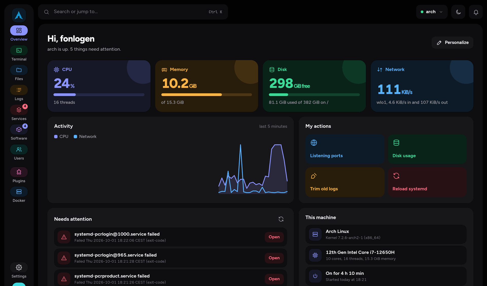

## Status

LinuxAdmin is early software. It runs and I use it on my own machine, but it has had little exposure.

- Tested by hand on Arch Linux: PAM sign-in, admin unlock through `sudo`, every section in the screenshots below.
- Admin actions (package transactions, user and group changes, file operations as root, config changes) are covered mostly by unit tests, with limited manual testing.
- The package manager backends for apt, dnf, zypper and Flatpak exist and have unit tests. I have not run them on real Debian, Fedora or openSUSE machines.
- The PAM file in `packaging/` is written for Arch. Other distributions need small changes.
- There are no distribution packages yet. Releases are published on GitHub with signed archives.
- Self-update from GitHub releases is implemented (Settings > About) but has not yet been exercised on a live install.
- A security review of the code is in [docs/SECURITY-REVIEW.md](docs/SECURITY-REVIEW.md). It lists each finding and how it was fixed. It is a self review, not an external audit.

## Features

### Overview

CPU, memory, disk and network at a glance, an activity chart, a list of failed units and pending problems, and a card with machine details. The dashboard is customizable: widgets can be added, resized and reordered, and you can define your own command shortcuts ("My actions").

### Terminal

Shell sessions in the browser, backed by a real PTY running as the signed-in user. Sessions can be split and started on saved hosts. A bar of one-click commands (disk usage, memory, failed services, follow system log) and your own saved commands sits under the terminal.

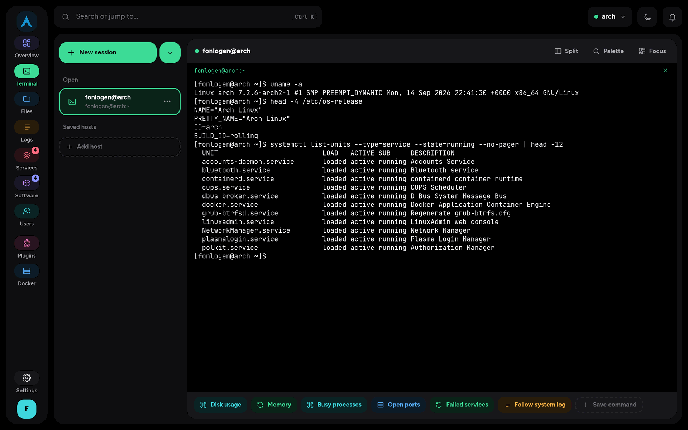

### Files

A file manager with places (home, root, recent, starred, trash), bookmarks, tabs, a split view, grid and list layouts, search, upload and download. It works as your user. When you unlock administrator rights it can work on system files as root. SFTP remotes are planned.

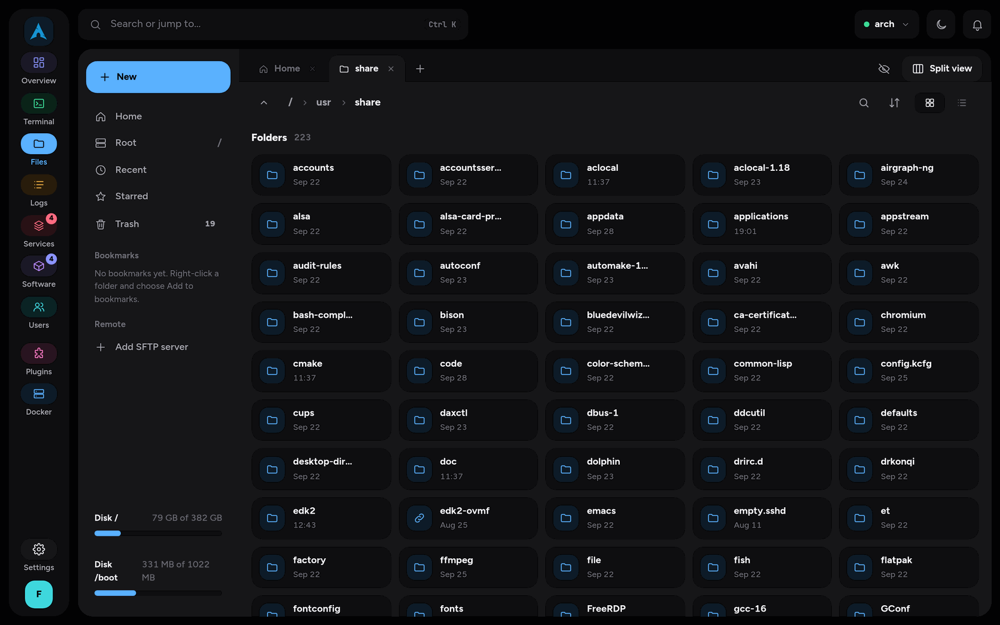

### Logs

One view over the systemd journal, the kernel log, individual services and plain log files such as `/var/log/pacman.log`. Filter by level and by text, pick a time range, follow live, and see a histogram of entries over time.

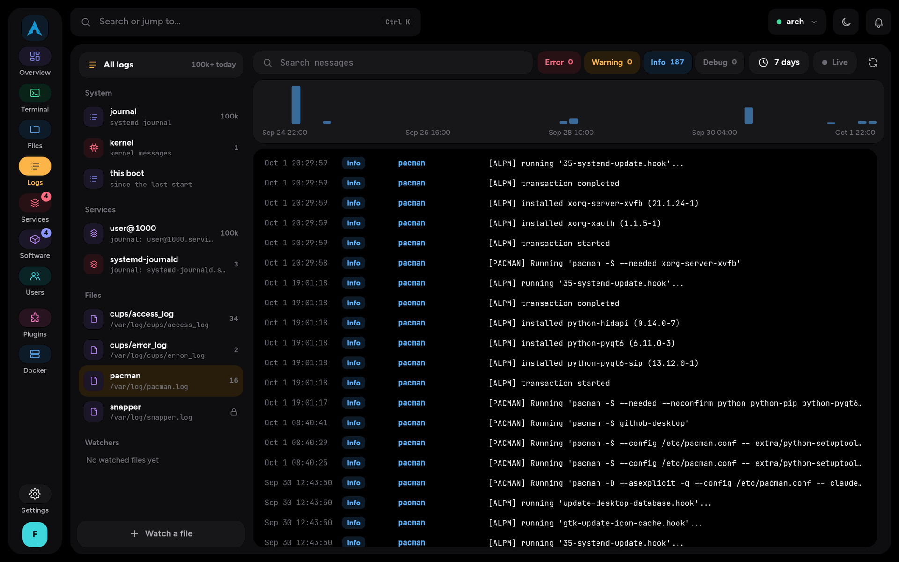

### Services

All systemd units grouped by state and by purpose (web, containers, system), as a table or as cards. The details panel for a unit shows status, process ID and memory, a live journal tab, the unit file and its dependencies. You can start, stop, restart, reload, enable at boot and mask units.

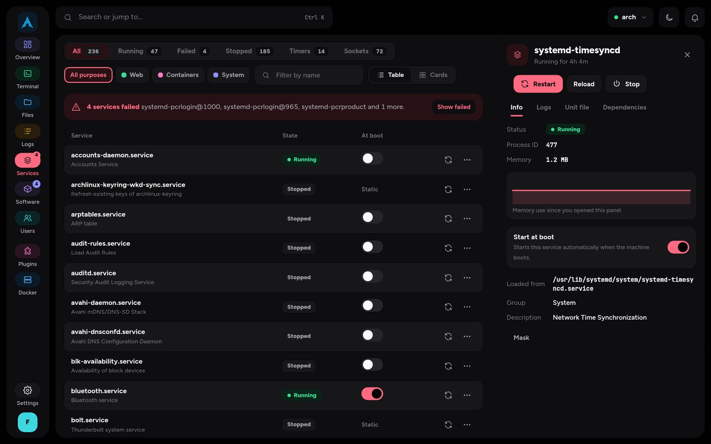

### Software

Updates, search, installed packages and history for the system package manager, plus Flatpak when present. Updates can run now or be scheduled. On Arch, AUR packages are listed and searched, and removed through pacman. Installing and upgrading AUR packages stays in the terminal on purpose, because AUR builds must not run as root.

| Manager | Detected by |
|---|---|
| pacman (and AUR through `yay` or `paru`) | `pacman` in PATH |
| apt | `apt-get` and `dpkg-query` |
| dnf | `dnf` and `rpm` |
| zypper | `zypper` and `rpm` |
| Flatpak | `flatpak` |

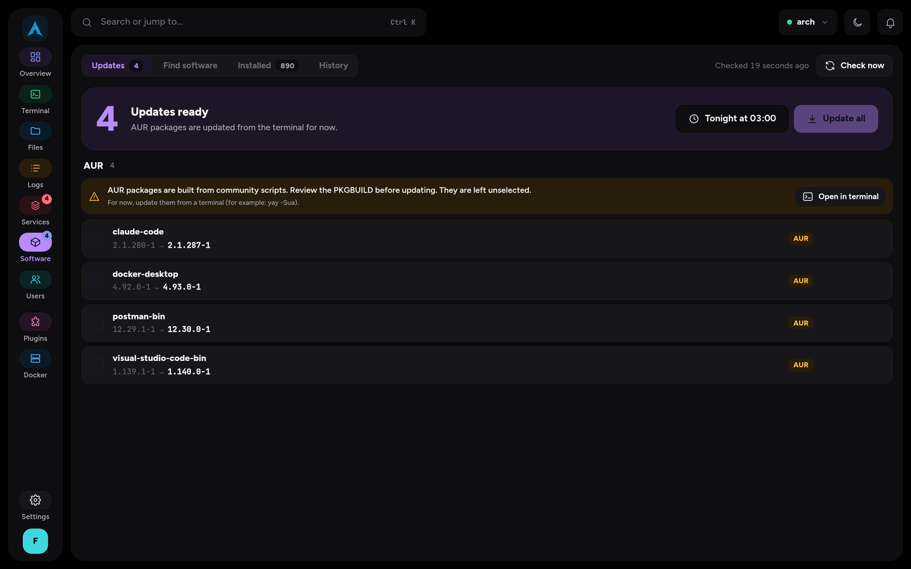

### Users

People, system accounts and groups, as cards or as a table. Create, modify and delete accounts, set passwords, grant or remove admin rights, lock and unlock accounts, manage SSH keys and end user sessions. Some details, such as lock state and password age, need administrator rights to read.

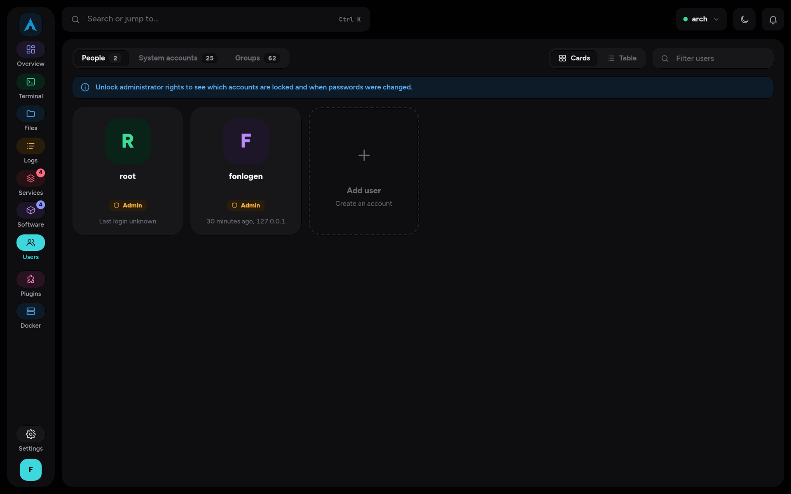

### Plugins

Plugins add pages, dashboard widgets and terminal snippets. The repository ships one first-party plugin for Docker. The Plugins section lists installed plugins, shows what each one is allowed to do before you enable it, and has tabs for updates, a catalog, security policy and developer mode. See [Plugins](#plugins) below.

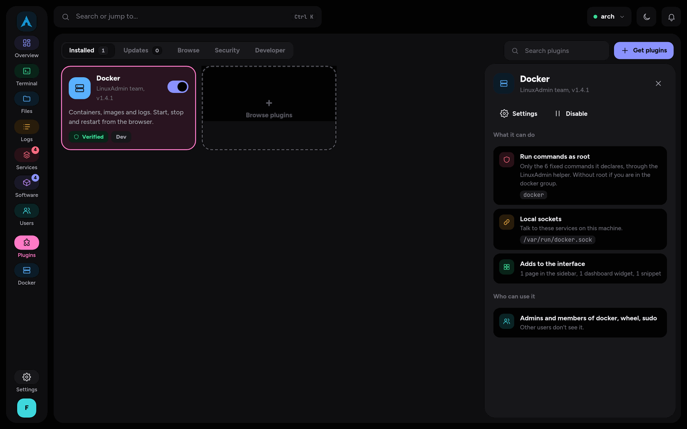

### Settings and themes

Nine built-in themes (OLED, OLED Mono, Midnight, Graphite, Fjord, Forest, High contrast, Daylight, Linen), custom themes, English and Italian, notification preferences, and server settings (sign-in and security, web server and TLS, plugin policy, hosts). Server settings need administrator rights. Preferences are stored per user on the server, so they follow you between browsers.

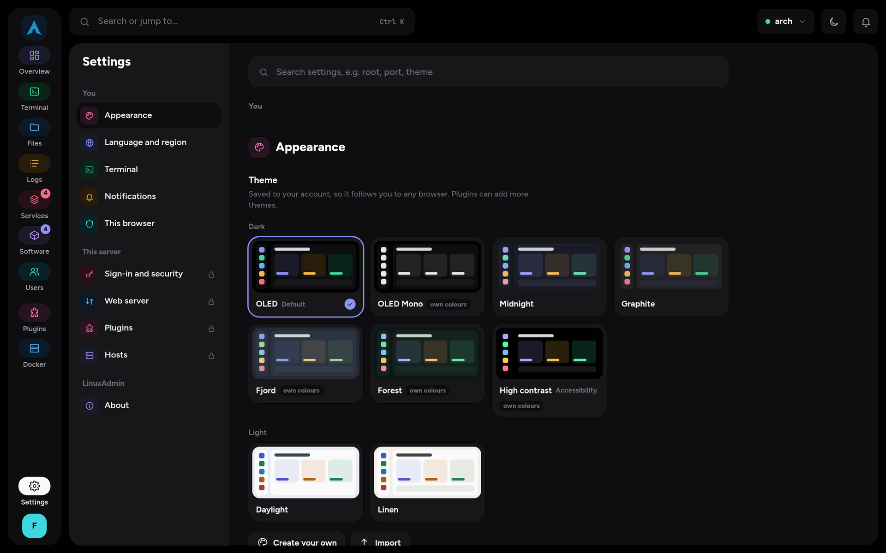

### Sign-in and small screens

The sign-in page shows the host name and distribution. The interface adapts to phone widths with a bottom navigation bar.

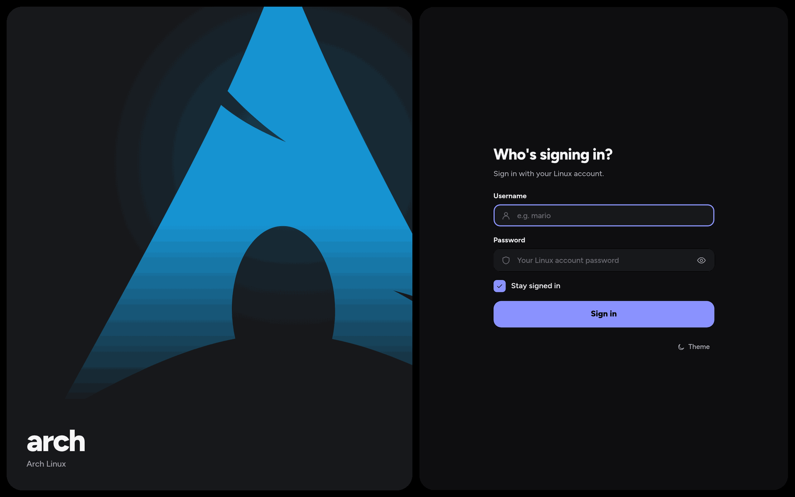

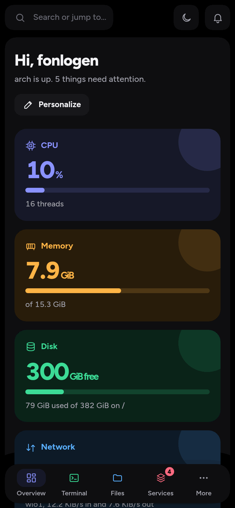

## How it works

Two binaries. The daemon runs once per machine; each signed-in user gets their own bridge process.

```
browser --HTTPS / WebSocket--> linuxadmind (root, one per machine)
                                 |  PAM sign-in, sessions, routing, static files
                                 |
                                 +-- stdio JSON --> linuxadmin-bridge  (runs as the signed-in user)
                                 |
                                 +-- stdio JSON --> linuxadmin-bridge --admin
                                                    (root, started with `sudo -S`
                                                     only after the user unlocks)
```

- `linuxadmind` serves the web app on port 9090, authenticates with PAM, keeps sessions and routes requests. It does not change the system itself.
- `linuxadmin-bridge` does the system work: systemd, files, journal, packages, users. The daemon starts one bridge per session with the user's uid, gid and groups.
- Administrator rights use `sudo`. When you unlock, the daemon runs `sudo -S -- linuxadmin-bridge --admin` as you and writes your password to its standard input. The sudoers policy decides. If you may not use sudo, unlocking fails. The root bridge stops after 5 minutes without admin calls by default (configurable, including "until sign-out"), or when you lock or sign out.

Details are in [docs/ARCHITECTURE.md](docs/ARCHITECTURE.md) and the per-section API notes in [docs/api/](docs/api/).

## Security model

- **Authentication** is PAM, through the service `linuxadmin` (falls back to `login`). Accounts with a `nologin` or `false` shell, a restricted shell, or a shell missing from `/etc/shells` cannot sign in. Failed attempts are rate limited per client address.
- **Authorization** is `sudo`. LinuxAdmin has no user database and no role system of its own. A user can do as root what sudoers lets them do, and nothing more.
- **Root login is off** unless `allow_root = true` is set in the configuration.
- **Sessions** use 256-bit random tokens stored only as SHA-256 hashes, an `HttpOnly`, `SameSite=Strict` cookie, an idle timeout and an absolute lifetime. Accounts are re-checked periodically, so removing a user from a group or locking an account ends the session.
- **CSRF**: every POST needs the header `X-Requested-With: linuxadmin`, and a present `Origin` must match the host.
- **Plugins** run in a sandboxed iframe with an opaque origin and a strict content security policy. They have no cookies and no direct API access. A broker enforces the capabilities declared in the plugin manifest. Plugins must be signed with the project key, or `plugins.allow_unsigned` must be turned on. See [docs/PLUGIN-SIGNING.md](docs/PLUGIN-SIGNING.md).
- **Findings and fixes** from the self review are listed in [docs/SECURITY-REVIEW.md](docs/SECURITY-REVIEW.md).

Run it only on networks you trust until it has had more review. A binary that runs as root and executes commands for browser users is a high-value target.

## Requirements

To run:

- Linux with systemd, PAM and `sudo`
- A user in a sudoers rule that allows running the bridge (on Arch, `%wheel ALL=(ALL) ALL`)

To build:

- Go 1.24 or newer
- gcc and the PAM headers (`pam_appl.h`), because the PAM wrapper uses cgo
- Node.js and npm for the web app

## Install from source

```sh
git clone https://github.com/Fonlogen/LinuxAdmin.git
cd LinuxAdmin
make build                          # builds web/dist and server/bin/*
sudo ./packaging/install-dev.sh     # installs and starts the systemd service
```

Read the script before you run it. It installs:

| File | Installed as |
|---|---|
| `server/bin/linuxadmind` | `/usr/bin/linuxadmind` |
| `server/bin/linuxadmin-bridge` | `/usr/lib/linuxadmin/linuxadmin-bridge` |
| `web/dist/` | `/usr/share/linuxadmin/web/` |
| `plugins/docker` | `/usr/share/linuxadmin/plugins/docker/` |
| `packaging/pam.d/linuxadmin` | `/etc/pam.d/linuxadmin` |
| `packaging/linuxadmin.service` | `/etc/systemd/system/linuxadmin.service` |

Then open `https://<host>:9090` and sign in with a Linux account. On first start the daemon generates a self-signed certificate in `/etc/linuxadmin/tls/`, so the browser shows a warning once. To remove everything except the configuration, run `sudo ./packaging/install-dev.sh --remove`.

A PKGBUILD and distribution packages are not available yet. See [packaging/README.md](packaging/README.md).

## Configuration

The file is `/etc/linuxadmin/linuxadmin.conf` in TOML. It is optional, and missing keys use the defaults below. Most keys can also be changed in Settings with administrator rights, which keeps a `.bak` copy of the previous file.

```toml
listen = "0.0.0.0:9090"
allow_root = false

[login]
show_ip = true          # show the server address on the sign-in page
max_failures = 5        # failed attempts per client before a temporary block

[session]
timeout = "12h"         # idle timeout
admin_unlock = "5m"     # root bridge stops after this long without admin calls; "0s" = until sign-out

[tls]
mode = "self-signed"    # self-signed, letsencrypt or custom
redirect = true
# cert = "/path/to/cert.pem"   # used when mode = "custom"
# key  = "/path/to/key.pem"

[plugins]
allow_unsigned = false
dev = false

[updates]
channel = "stable"
auto_check = true
auto_install = false
auto_install_at = "03:30"
```

The `updates` keys control self-update: the release channel, automatic checks, and an optional nightly install. See [docs/RELEASING.md](docs/RELEASING.md) for how releases are built and signed.

Per-user preferences (theme, language, dashboard layout) live in `~/.config/linuxadmin/`.

## Development

```sh
make build-server        # server/bin/linuxadmind, linuxadmin-bridge, devclient
make test-server         # go vet and go test
make build-web           # web/dist
```

Run the daemon in development mode, which does not need root:

```sh
make dev                 # daemon on 127.0.0.1:9090, proxies the UI to Vite on :5173
make dev-web             # Vite dev server, in a second terminal
make dev-dist            # daemon serving the built web/dist instead of Vite
```

`--dev` runs as your user, listens on plain HTTP on loopback, and lets only your own account sign in. PAM still checks your password, and admin unlock still runs the real `sudo`.

For work that does not need a password, use the no-auth mode:

```sh
make dev-noauth
```

The daemon prints a one-time sign-in URL (`http://127.0.0.1:9090/api/dev/noauth?token=...`). Open it in the browser to get a session cookie. The mode refuses to start without `--dev`, as root, or on a non-loopback address. Admin calls still need a real unlock. `server/tools/devclient` calls the API from the command line.

Web app checks:

```sh
npm --prefix web run typecheck
npm --prefix web run lint
npm --prefix web run i18n:check
npm --prefix web test
```

Contributor notes: [server/README.md](server/README.md), [docs/DESIGN-RULES.md](docs/DESIGN-RULES.md), [web/CONTRIBUTING-SECTIONS.md](web/CONTRIBUTING-SECTIONS.md). The approved screen designs are in `docs/design/`; open `docs/design/index.html`.

## Plugins

A plugin is a folder with `manifest.json` and one ES module. The manifest declares pages, widgets, snippets, the commands the plugin may run, and the files and sockets it may touch. Plugin code runs in a sandboxed frame and talks to the app through a small SDK.

- SDK and examples: [web/PLUGIN-SDK.md](web/PLUGIN-SDK.md)
- Manifest, API and isolation: [docs/api/plugins.md](docs/api/plugins.md)
- Signing: [docs/PLUGIN-SIGNING.md](docs/PLUGIN-SIGNING.md)

The Docker plugin in `plugins/docker` is a working example.

## Project layout

```
server/            Go module: daemon, bridge, modules for each section
  cmd/             linuxadmind, linuxadmin-bridge
  internal/        config, rpc, pam, sys, server, bridge, modules/<section>
  tools/           devclient
web/               React and TypeScript app (Vite)
  src/sections/    one folder per section
plugins/           first-party plugins and the plugin catalog
packaging/         systemd unit, PAM file, install script
docs/              architecture, API notes, design rules, security review
```

## Roadmap

- Test and fix on Debian, Fedora and openSUSE
- Distribution packages, starting with a PKGBUILD
- Desktop app wrapper
- More first-party plugins

## License

Not decided yet.
